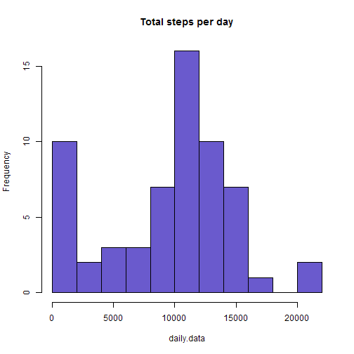
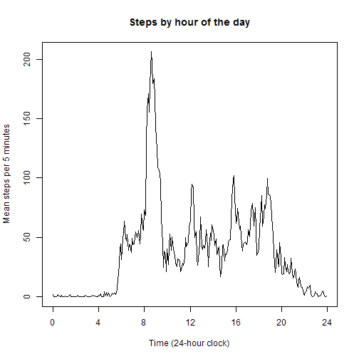
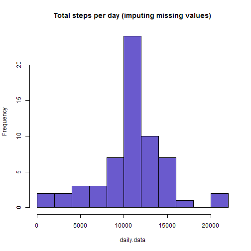
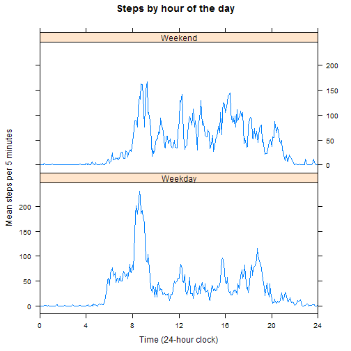

## Loading and preprocessing the data


```r
setwd("D:/Ian/git/datasciencecoursera/RepData_Assessment1")
unzip("activity.zip")
# Use colClasses to set up the date vector
activity <- read.csv("activity.csv", colClasses = c("integer", "Date", "integer"))
```

## What is mean total number of steps taken per day?


```r
# Use tapply to add up the steps taken within each day
daily.data <- with(activity, tapply(steps, date, sum, na.rm = TRUE))
hist(daily.data, 9, col = "slateblue", main = "Total steps per day")
```

 

```r
# Calculate the mean and median steps and report them in-line just below
m <- mean(daily.data)
med <- median(daily.data)
```
The mean and median number of steps in the imputed data are   9354.2 and   10395 respectively.

## What is the average daily activity pattern?


```r
# Use tapply to average the steps taken in each 5-minute interval
timed.data <- with(activity, tapply(steps, interval, mean, na.rm = TRUE))
# Use time measured in hours rather than interval for the x axis
plot(seq(0, 1435, 5)/60, timed.data, type = "l", xaxp = c(0, 24, 6),
     main = "Steps by hour of the day",
     xlab = "Time (24-hour clock)", ylab = "Mean steps per 5 minutes")
```

 

```r
# Calculate most active time and report this in-line just below. N.B.
# tapply uses interval to name the rows of timed.data and the grep
# expression inserts a colon before the two "minutes" columns of the code
busy.bee <- sub("(..)$", ":\\1",
                names(timed.data[timed.data == max(timed.data)]))
```
The time at which most steps were taken is 8:35.

## Imputing missing values

```r
# Calculate number of missing values and report this in-line just below
t.miss <- sum(is.na(activity$steps))
```
The total number missing values for steps is 2304.  

As the steps data are missing for a subset of days rather than a subset of times, my imputation strategy is to replace the missing values with the mean for the same 5-minute time interval of day. The new version of the activity dataset is stored in activity.new.


```r
activity.new <- activity
# The means have already been calculated and stored in timed.data. Index
# the correct row of timed.data by splitting the interval code into time
# in hours, each contributing 12 measures, and minutes, contributing one
# measure each 5 min., Add 1 as midnight is the 1st, not 288th, measure.
activity.new$steps <- with(activity, replace(steps, is.na(steps),
    timed.data[(interval %/% 100)*12 + (interval %% 100)/5 + 1]))
```

```
## Warning in replace(steps, is.na(steps), timed.data[(interval%/%100) * 12
## + : number of items to replace is not a multiple of replacement length
```

```r
# Use the same code as before for the histogram, applied to activity.new
daily.data <- with(activity.new, tapply(steps, date, sum, na.rm = TRUE))
hist(daily.data, 9, col = "slateblue",
    main = "Total steps per day (imputing missing values)")
```

 

```r
# Recalculate mean and median steps and report them in-line just below
m <- mean(daily.data)
med <- median(daily.data)
```
The mean and median number of steps in the imputed data are  10766.2 and  10766.2 respectively.

Imputation pushes up the mean and median number of steps per day. There were no data recorded on 8 whole days. In the unimputed data, each of these contributes zero steps to the mean, whereas in the imputed data they each contribute the mean number of steps (10766.2). The revised median also falls within the set of 8 days with 10766.2 steps imputed to them.

## Are there differences in activity patterns between weekdays and weekends?

```r
# Use the imputed data (i.e. activity.new$steps) for this analysis
day <- weekdays(activity.new$date)
weekend <- day == "Saturday" | day == "Sunday"
# Use aggregate for this part, not tapply, as it outputs a dataframe
timed.data <- with(activity.new,
                   aggregate(steps, list(interval, weekend), mean))
# Rename the columns of the data frame
names(timed.data) <- list("time", "weekend", "steps")
# Convert weekend to a factor with the requested labels
timed.data$weekend <- as.factor(ifelse(timed.data$weekend,
                                       "Weekend", "Weekday"))
# Replace intervals with time in hours (the sequence gets recycled)
timed.data$time <- seq(0, 1435, 5)/60
library(lattice)
xyplot(steps ~ time | weekend, data = timed.data, layout = c(1,2), 
       type = "l", main = "Steps by hour of the day",
       ylab = "Mean steps per 5 minutes",
       xlab = "Time (24-hour clock)", xlim = c(0, 24),
       scales = list(x = list(at = seq(0, 24, 4))))
```

 
The activity pattern differs notably between the weekend and weekdays: the anonymous subject's level of activity is higher at the weekend but is spread throughout the day, whereas there is a clear peak in their  activity around 8.30am during the week. The subject also gets up and goes to bed a bit later at the weekend.
